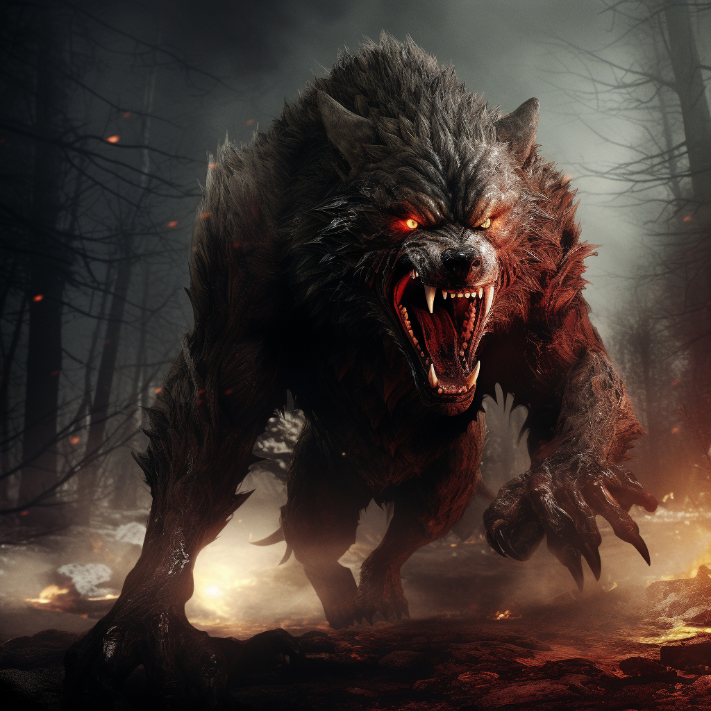

# Likantropia

Ścieżka ognia pozwala na tworzenie potężnych ataków obszarowych.\
Ataki mogą [podpalać](/docs/efekty/podpalenie.md) przeciwników.

# Zdolności:

S - ilość sukcesów w rzucie kośćmi many

___

**Przemiana w wilkołaka**

Trudność: 5

Sukcesy podziel na:
- zwiększoną kość życia
- zwiekszoną kość many
- dodatkowe kroki
- zwiększony zasięg
___
**Furia**

Ofensywna zdolność wręcz.

Atakujesz przeciwnikow furią ciosów.

Jeżeli jesteś wilkołakiem, możesz zaatakować dwa cele bez dodatkowego kosztu many.

Kolejny cel +2M
___
**Masakrowanie**

Ofensywna zdolność wręcz, wilkołak

Atakujesz przeciwnika. Zadajesz S obrażeń.\
Trafiając zatapiasz w nim swoje pazury dodając efekt masakry o poziomie S.

Kolejne trafione przez ciebie ataki w tego samego przeciwnika mają S premii do rzutu.
Kolejne S przy ataku zwiększają poziom efektu.
___
**Zdolność**

___
**Zdolność**

# [Zdolność epicka](/docs/zdolnosc-epicka.md):

**Zdolność**
