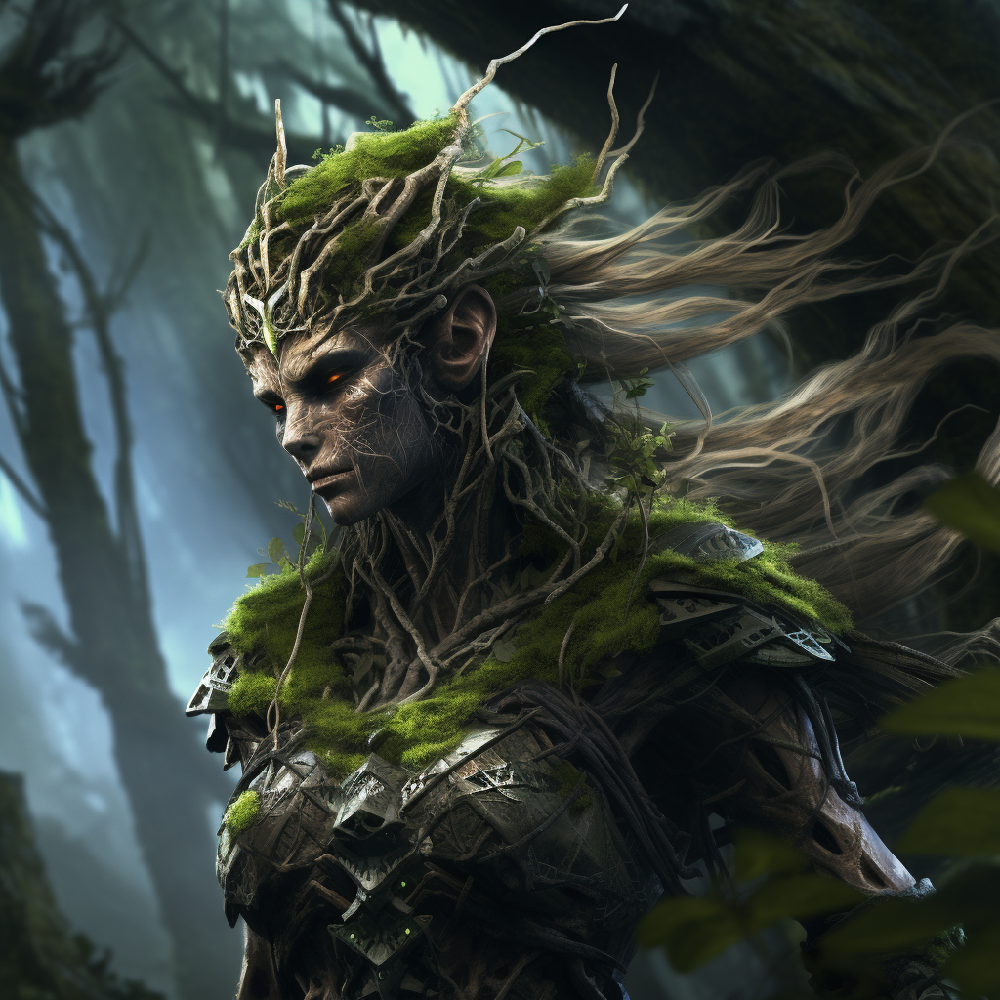

# Natura

...

# Zdolności:

S - ilość sukcesów w rzucie kośćmi many

___

**Korowa zbroja**

Trudność: 5

Twoja skóra pokryta jest grubą korą.

Zwiększasz swój pancerz o S do końca walki.

___

**Osłabiający pył**

Sypiesz pyłem w twerz przeciwnika. 

Zdolność dystansowa\
Trudność: kość many przeciwnika

Efekt zmniejsza się o 1 po każdym użyciu kości many.
___

**Zbroja z cierni**

Na twojej skórze wyrastają ciernie.

Dostajesz S poziomów efektu cierni.

Kiedy przeciwnik cię atakuje otrzymuje atak S swoich kości many.

Efekt zmniejsza się o 1 przy każdym użyciu
___

**Trujące pnącza**

Tworzysz pnącza, które ograniczają i otruwają przeciwnika.

Trudność: kość many przeciwnika

Podziel S pomiędzy:
* poziomem ograniczenia kroków
* poziomem [zatrucia](/docs/efekty/zatrucie.md)

Każdy dodatkowy cel stojący obok pierwszego +1M

# [Zdolność epicka](/docs/zdolnosc-epicka.md):

**Miażdżące oplątanie**

Ofensywna zdolność obszarowa.

Przywołujesz korzenie i liany, które oplątują wrogów.

Bazowy koszt many: 3M

Obszar 3x3

Podziel S na:
* poziomem ograniczenia kroków
* obrażeniami fizycznymi
* zwiększonym obszarem 4x4 = 1M, 5x5 = 2M
