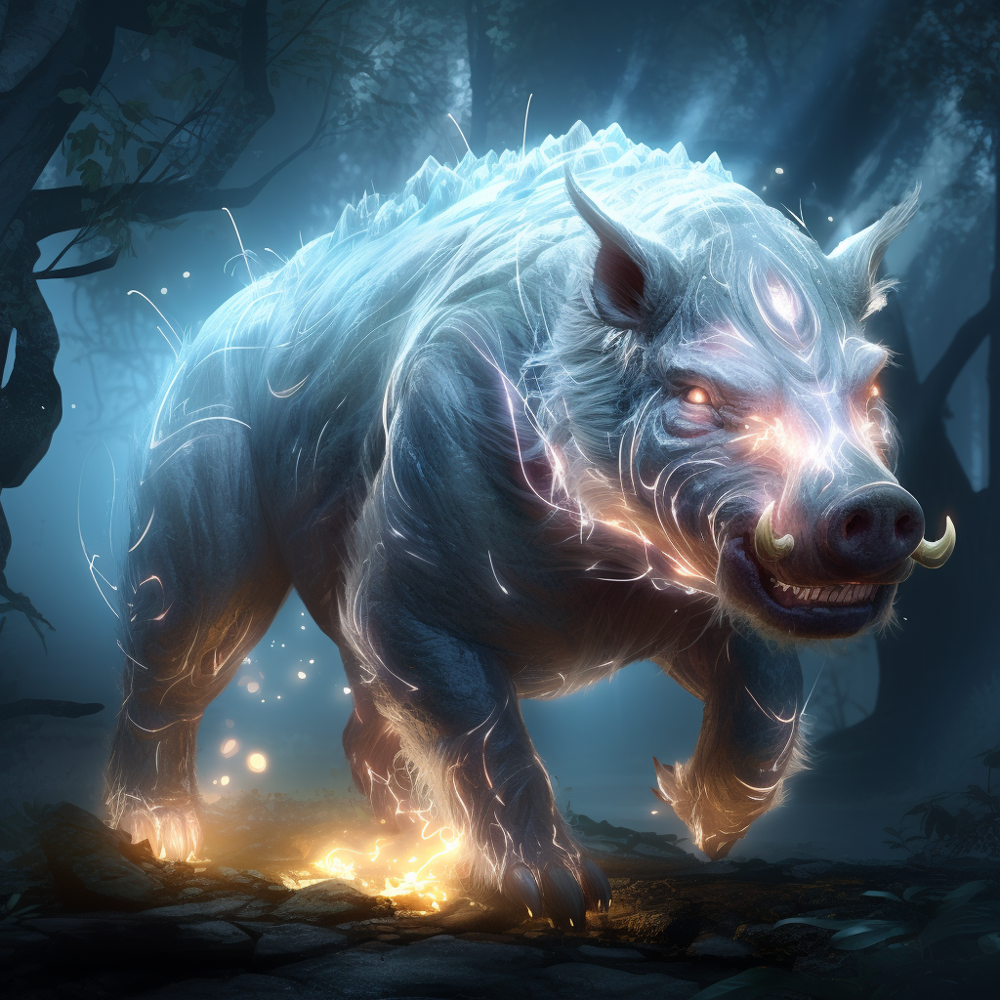

# Przywoływania

Druid przywołuje zwierzęta i rośliny, które pomagają mu w walce.



# Zdolności:

S - ilość sukcesów w rzucie kośćmi many

___

**Przywołanie zwierzęcia**

Trudność: Wybrana kość zwierzęcia.

Przywołujesz zwierzęcego sojusznika z S wybranymi kośćmi.

Specjalna zdolność zwierzęcia zależy od wybranego typu:

Dzik - może wydawać S na odepchnięcie\
Pająk - może dystansowo użyć pajęczyny, która odejmuje S kroków przeciwnikom\
Ptak - nie prowokuje okazyjnych ataków\
Wąż - może zrobić [pochwycenie](/docs/efekty/pochwycony.md)
___

**Przywołanie rośliny**

Trudność: Wybrana kość rośliny.

Z ziemi wyrasta wybrana przez ciebie roślina.

Roślina nie ma kroków, ale celem jej akcji zawsze mogą być dwie postaci sąsiadujące z rośliną.

Grzyb - powoduje S poziom [zatrucia](/docs/efekty/zatrucie.md)\
Pnącze - oplącuje odejmując S kroków przeciwnikom\
Paproć - dodaje S pancerza przyległym - może być użyte jako reakcja na atak w sojusznika\
Borówki - leczą S ran
___

**Osłona przywołańca**

Możesz przenieść obrażenia z przywołanego zwierzęcia na siebie i na odwrót.

___

**Połączenie ze zwierzęciem**

Możesz wydawać swoją manę na akcje przywołanych zwierząt.\
Rzucają twoją kością many.

# [Zdolność epicka](/docs/zdolnosc-epicka.md):

**Przywołanie niedźwiedzia**

Przywołujesz potężnego niedźwiedzia.

Trudność: 5

Podziel S na:
* rodzaj kości powyżej 4
* ilość kości powyżej 1

```
Przykład:

Rzut 5S

Niedźwiedź
3k10 (2 dodatkowe kości i zwiększona kość za 3S)
```
