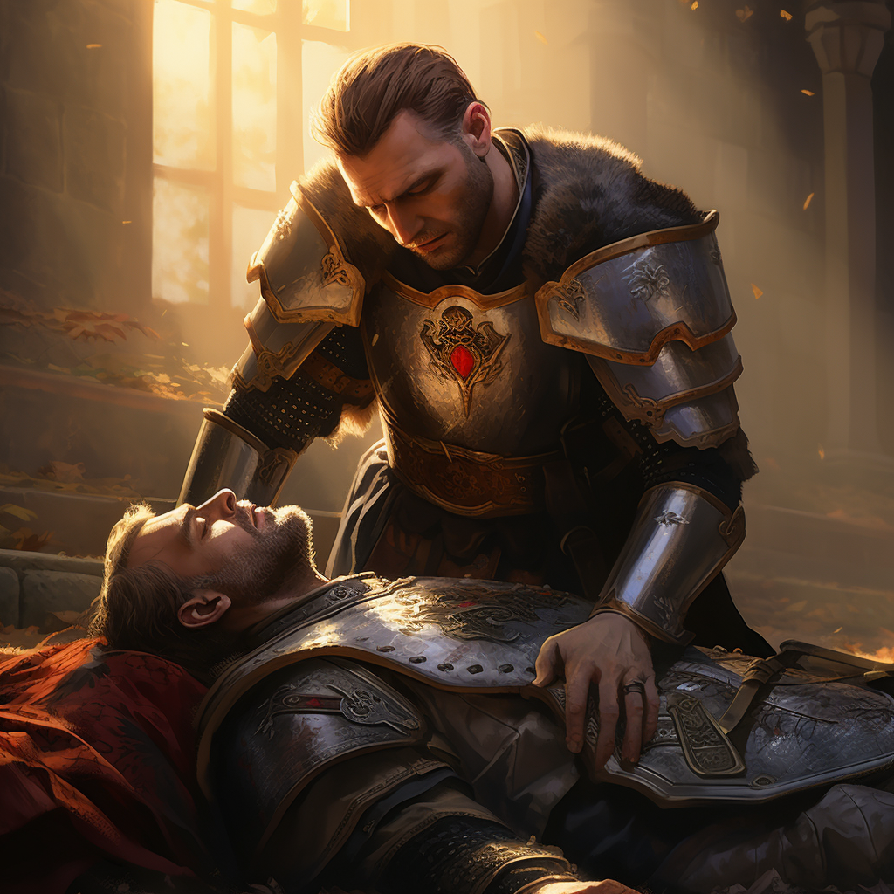

# Leczenie

Leczysz sojuszników, zdejmujesz z nich negatywne efekty.

# Zdolności:

S - ilość sukcesów w rzucie kośćmi many

___

**Leczenie**

___

**Leczenie grupowe**

___

**Transfuzja**

___

**Usunięcie efektu**

# [Zdolność epicka](/docs/zdolnosc-epicka.md):

**Zmartwychwstanie - wstanie i grupowe leczenie**
