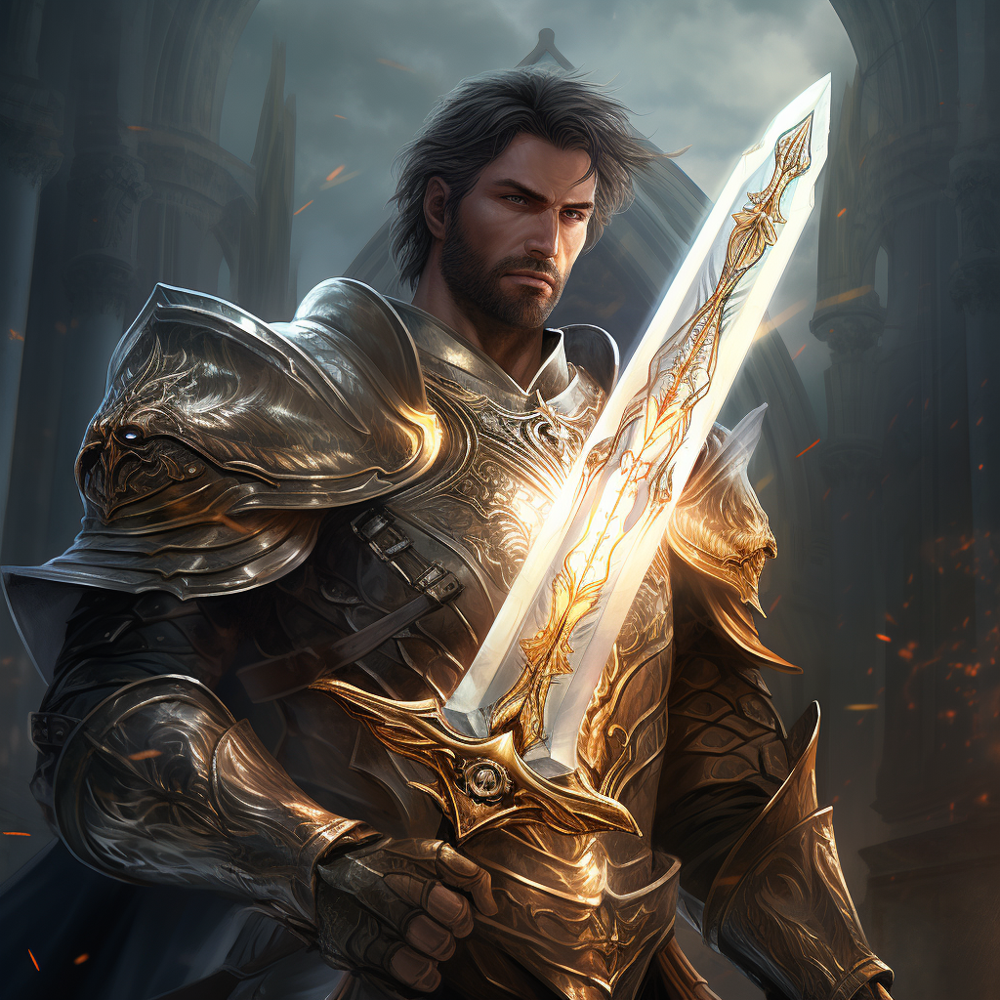

# Paladyn

Paladyn walczy świętym orężem, którego siła rośnie wraz z wykonywaniem woli bogów.\
Ci w ramach wdzięczności mogą uchronić Paladyna i jego towarzyszy przed śmiercią.

# Zdolności:

S - ilość sukcesów w rzucie kośćmi many

___

**Święta broń**

Kiedy atakujesz niewiernych, twoja broń wypełnia się świętym blaskiem.

Zadaj S obrażeń i dodaj S poziomów efektu świętej broni.

Efekt dodaje poziom premii do ataku. Kumuluje się i nie zmniejsza do końca walki.
___

**Kolumna światła**

Uderzasz kolumną światła, która oślepia wrogów.

Uderzasz w przeciwników na obszarze 2x2

Każdy S dodaje poziom efektu [oślepienia](/docs/efekty/oslepiony.md)

___

**Męczczennictwo**

Kiedy otrzymujesz obrażenia, twoja święta broń przepełnia się blaskiem.

Dodaj otrzymane obrażenia poziomu efektu Świętej Broni.

___

**Pogrom - atak w pierwszy cel, później w drugi jeżeli pierwszy zabił. I w trzeci jeżeli drugi zabił. Kość many zmniejszona.**

Ściągasz na przeciwników gniew bogów.

Atakujesz w pierwszy cel.\
Jeżeli go zgładzisz, atakujesz w drugi cel - jedną kością many mniej.\
Jeżeli go zgładzisz, atakujesz kolejny - jedną kością many mniej.

Do momentu kiedy gniew bogów nie pozwoli Ci zgładzić kolejnego niewiernego.

# [Zdolność epicka](/docs/zdolnosc-epicka.md):

**Boska interwencja**

Bogowie mają w opiece ciebie i twoich sojuszników. Mogą was ocalić od pewnej śmierci.

Po tym jak przeciwnik rzuci za swoją akcję, wykonaj rzut many.\
Jeżeli liczba S jest równa lub większa ilości many jaką wydał przeciwnik, jego akcja nie ma żadnego efektu.\
Bogowie was ocalili.
