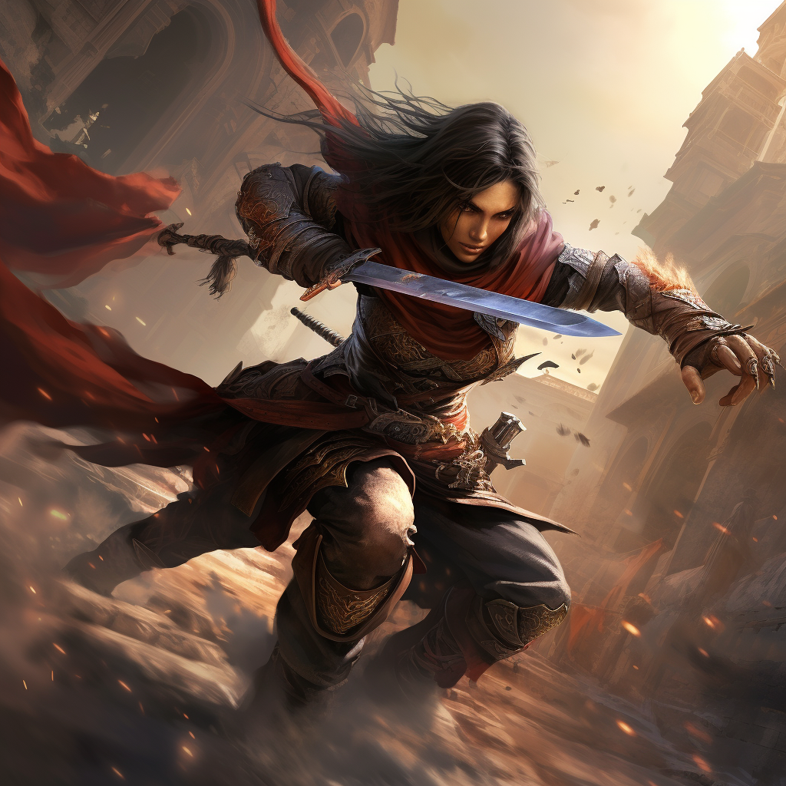

# Nożownik

Nożownik dynamicznie przemieszcza się pomiędzy przeciwnikami zadając im serie dotkliwych ran.

# Zdolności:

S - ilość sukcesów w rzucie kośćmi many

___

**Szybkie cięcia**

Zdolność ofensywna.

Atakujesz przeciwnika. Możesz wykonać błyskawiczny drugi atak rzucając połową wydanej many. Celem drugiego ataku może być w ten sam cel lub inny oddalony maks o jeden krok.
___
**Atak z odskokiem**

Po wykonanym ataku możesz odskoczyć na S zadanych obrażeń, w dowolnym kierunku.

Nie prowokujesz okazyjnych ataków.
___
**Zabójcze rzuty**

Ofensywna zdolność dystansowa.

Eliminujesz osłabionych przeciwników precyzyjnymi rzutami nożami.

Jeżeli atakując zabijesz cel, możesz wybrać kolejny i zaatakować jedną kością many mniej.
___
**Cios pod kolano**

Zdolność pasywna

Atakujesz przeciwnika, próbując zmniejszyć jego mobilność.
Podziel S pomiędzy rany i zmniejszone kroki przeciwnika.
# [Zdolność epicka](/docs/zdolnosc-epicka.md):

**Seria ataków**

Ofensywna zdolność wręcz

Bazowy koszt many: 3M

Robisz serię ataków z doskoku.

Po wykonanym ataku możesz odskoczyć na S zadanych obrażeń do kolejnego przeciwnika.

Ataki wykonujesz tak długo jak możesz doskoczyć do kolejnego celu.

Za każdy niewykorzystany krok dostajesz punkt inspiracji.

# Przykładowe [talenty](/docs/talent.md)

**Mobilność:**

Możesz przechodzić przez pola przeciwników.

**Finezyjna broń:**

Do ataków wręcz możesz dodać zręczność zamiast siły.

**Kroki pacyfisty:**

Jeżeli nie wykonujesz ataku w akcji, dodaj swój poziom do kroków.
