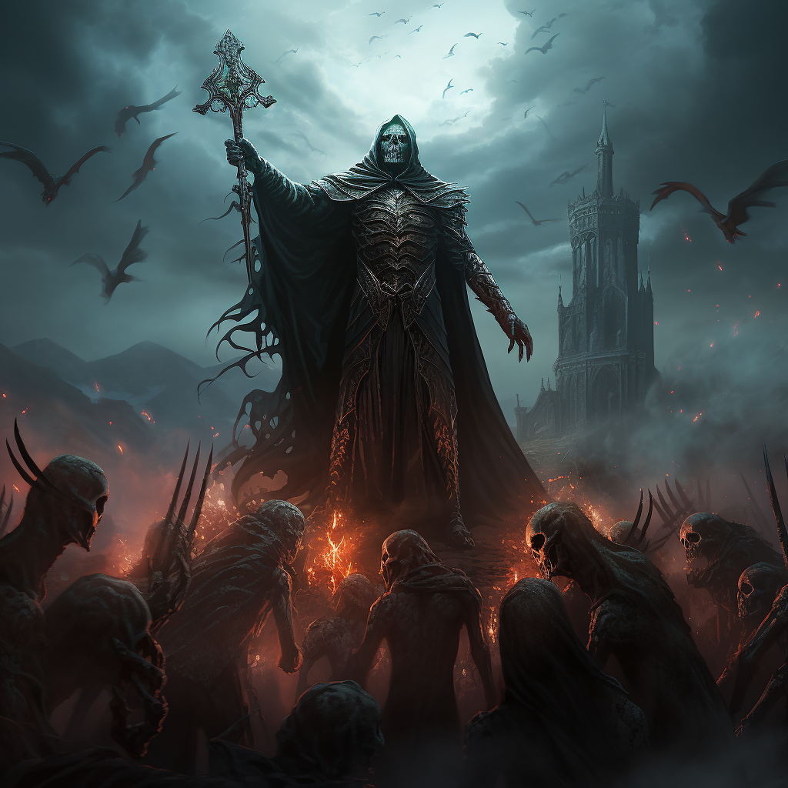

# Nekromancja

Nekromancja pozwala podnosić szkielety oraz poległych przeciwników.

<!--  -->

# Zdolności:

S - ilość sukcesów w rzucie kośćmi many

___

**Ożywienie szkieletu**

Zdolność dystansowa, wymaga ciała.

Trudność: Wysokość wybranego rodzaju kości szkieleta ([minion](/docs/boss-i-miniony.md))\

Tworzysz szkielet o S wybranych kości.

Możesz zwiększyć bazowy koszt:\
1M: Szkielet ma łuk i może atakować dystansowo\
2M: Szkielet jest nekromantą, atakuje dystansowo obrażeniami cienia i może tworzyć kolejne szkielety.

Szkielet atakuje wręcz - obrażenia fizyczne.
___

**Wampiryczna broń**

Zaklinasz broń dowolnej postaci. Broń zadaje dodatkowe nekrotyczne obrażenia i wysysa siły życiowe ofiary.

Trudność: 5

Broń otrzymuje wampiryczny efekt o poziomie S.

Kiedy wampiryczna broń zostanie użyta i zada obrażenia, ten kto ją dzierży może dodać wybraną ilość kości many do ataku. Maks poziomu efektu.\
Dodatkowo, liczba sukcesów przy trudności 5 na tych kościach leczy dzierżącego.

Poziom efektu zmniejsza się o ilość wykorzystanych kości.
___

**Nekrotyczny pocisk**

Bazowy koszt: 1M

Zadajesz przeciwnikowi obrażenia od cienia.
Jeżeli przeciwnik zginął, możesz automatycznie wykorzystać zdolność ożywienia szkieletu, używając tego samego wyniku.
___

**Podniesienie wroga**

Zdolność dystansowa, wymaga ciała.\
Trudność: Kość życia wroga

Podnosisz wroga. Każdy sukces dodaje 1 kość życia.\
Nie może przekroczyć maksymalnego życia celu.

Możesz wykorzystywać wszystkie jego umiejętności o jakich wiesz że istnieją.

# [Zdolność epicka](/docs/zdolnosc-epicka.md):

**Przetoczenie krwi**

Wznosisz się na wyżyny swoich zdolności nekrotycznych, manipulując życiem otaczających Cię sojuszników i wrogów. Dosłownie wysysasz krew z wrogich kreatur i pompujesz ją w rannych sojuszników.

Bazowy koszt: 3\
Trudność: Kości many

Wykonaj test. 

Każdy sukces przeciwko kości many wybranego wroga lub sojusznika w zasięgu zadaje mu ranę. Możesz również wyssać moc życiową z przywołanych nieumarłych. Trudność to zawsze 2.

Za każdą zadaną ranę możesz przenieść energię życiową, lecząc jedną ranę sobie, sojusznikowi lub przywołanemu nieumarłemu w zasięgu. 

Przywołany nieumarły może zyskać dodatkowe kości ponad początkowe zgodnie z zasadami [rozwijania kości życia i many](/docs/levelowanie-postaci.md).

# Przykładowe [talenty](/docs/talent.md)

**Szybkie wskrzeszenie:**

Kiedy masz farta w dowolnym rzucie, możesz wykorzystać zdolność Szkielet lub Szkielet Łucznik za wynik tego rzutu.
___
**Twarde kości:**

[Przewaga](/docs/przewaga.md) przy tworzeniu szkieletów.
___
**Szkielety żywiołów:**

Możesz zmienić typ zadawanych obrażeń szkieletów na ogień, lód lub truciznę.

Możesz zwiększyć koszt many o 1M aby szkielety mogły wykorzystywać sukcesy w ataku żeby zamiast obrażeń dodać poziom jednego z efektów:
* [podpalenie](/docs/efekty/podpalenie.md)
* [zmrożenie](/docs/efekty/zmrozenie.md)
* [zatrucie](/docs/efekty/zatrucie.md)
