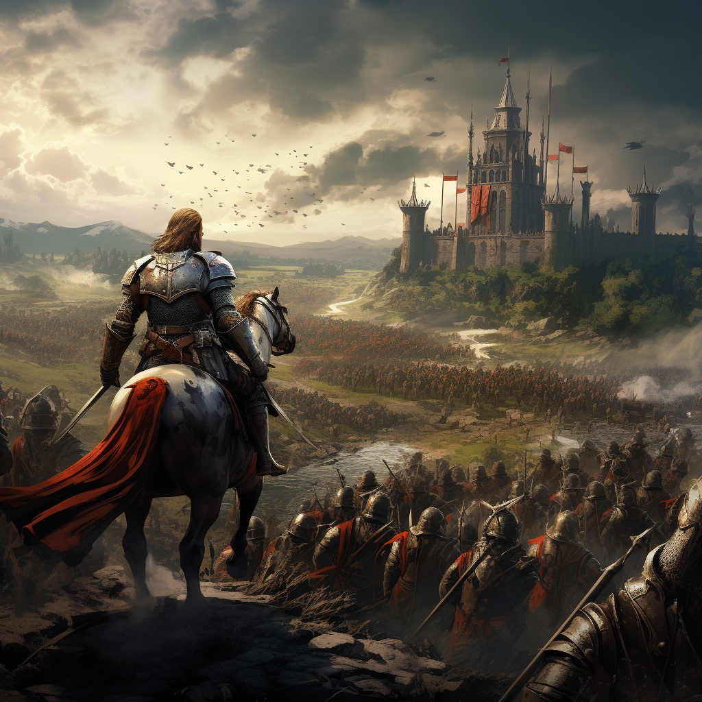

# Kapitan

Kapitan wydaje komendy, powodując że zgraja indywidualistów staje się skuteczną grupą bohaterów.\
Nawet przeciwnicy słuchają jego rozkazów.

# Zdolności:

S - ilość sukcesów w rzucie kośćmi many

___

**Przegrupowanie**

Trudność: 5

Przesuń sojuszników (w tym siebie) w sumie o S kroków.

Ta zdolność nie zużywa kroków.

___

**Atak formacją**

Trudność: 5

Koszt bazowy: 2 many

Każdy sojusznik w zasięgu (w tym ty) atakuje podstawowym atakiem za S/2 many.

___

**Ściana tarcz**

Trudność: 5

Wybierz grupę stojących obok siebie sojuszników.\
Dodaj im S pancerza przeciwko następnemu atakowi, którego obrażenia ten pancerz zmniejszy.

___

**Aura dowódcy**

Aura dodaje [przewagę](/docs/przewaga.md) sojusznikom stojącym obok.

# [Zdolność epicka](/docs/zdolnosc-epicka.md):

**Autorytet**

Twoje rozkazy niosą za sobą taki autorytet, że słuchają się ich nawet wrogowie.

Trudność: Kość many przeciwnika
Bazowy koszt: 3 many

Przesuwasz przeciwników w zasięgu o S kroków każdego. Przesunięcia powodują okazyjne ataki.

lub

Każdy przeciwnik w zasięgu atakuje podstawowym atakiem za S/2 many wybrany przez ciebie cel.
