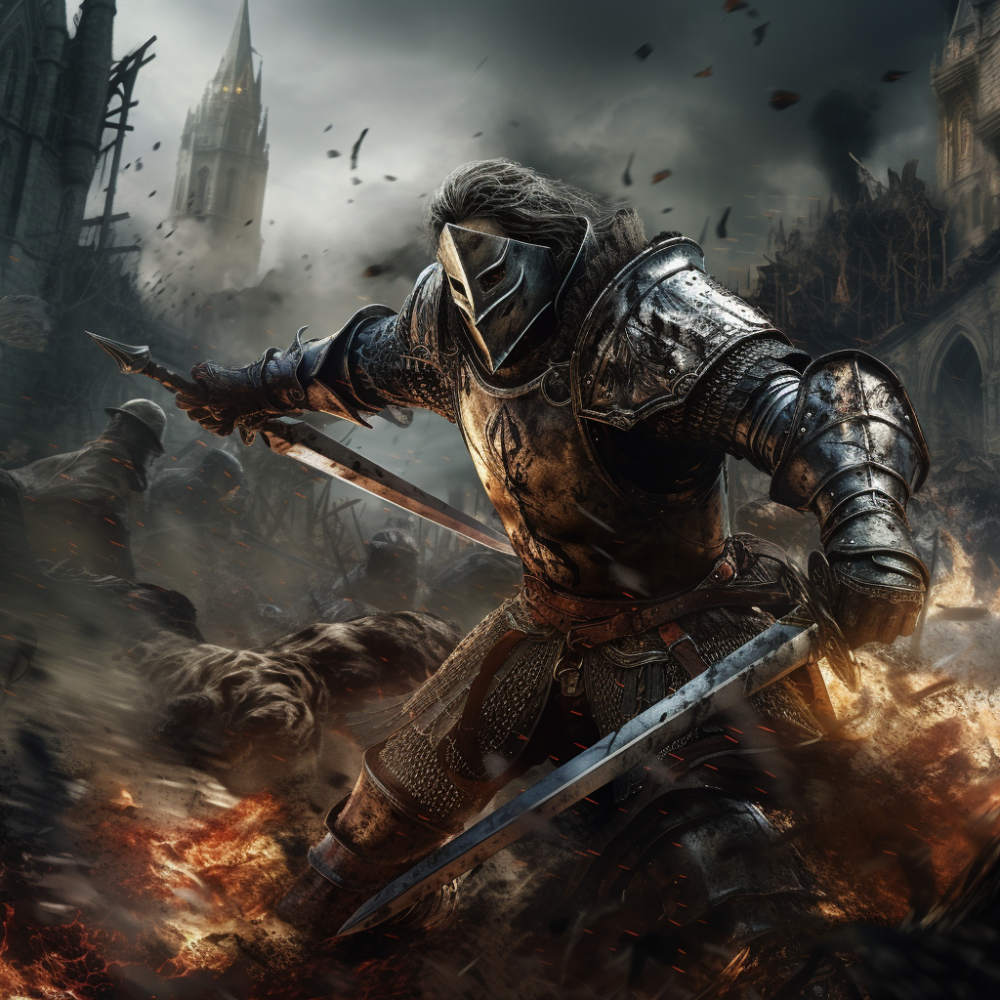

# Manewry

Ścieżka lodu pozwala na zmrażanie i zamrażanie przeciwników.\
Manipuluje też polem bitwy tworząc śliski teren przewracający przeciwników.

# Zdolności:

S - ilość sukcesów w rzucie kośćmi many

___

**Riposta**

___

**Ulepszony okazyjny**

___

**Rozpłatanie**

___

**Zamaszysty atak**

# [Zdolność epicka](/docs/zdolnosc-epicka.md):

**Zamieć**
