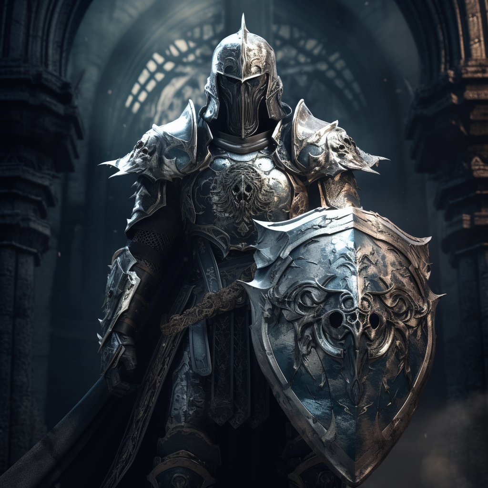

# Tarczownik

Tarczownik osłania sojuszników aby ci mogli się skupić na ataku. Woli stracić życie niż pozwolić ich zranić.

<!--  -->

# Zdolności:

S - ilość sukcesów w rzucie kośćmi many

___

**Uderzenie tarczą**

Uderzasz tarczą zwalając przeciwnika z nóg.

Jeżeli zadasz obrażenia przeciwnik jest [przewrócony](/docs/efekty/przewrocony.md)

___

**Rzut tarczą**

Rzucasz tarczą pomiędzy sojusznika a atakującego go przeciwnika.

Trudność: Kość many przeciwnika

Kiedy twój sojusznik dostaje rany - odejmij S od ich ilości.

___

**Poświęcenie**

Możesz przenieść obrażenia stojącego obok sojusznika na siebie
___

**Osłona przed okazyjnym**

Sojusznik stojący obok ciebie może [uciec](/docs/ucieczka.md) od przeciwnika nie prowokując okazyjnego ataku.

# [Zdolność epicka](/docs/zdolnosc-epicka.md):

**Postawa Tarczownika**

Bazowa trudność: 3 many

Rodzaj kości życia sojuszników w okół ciebie rośnie o S, dopóki obok ciebie stoją.
