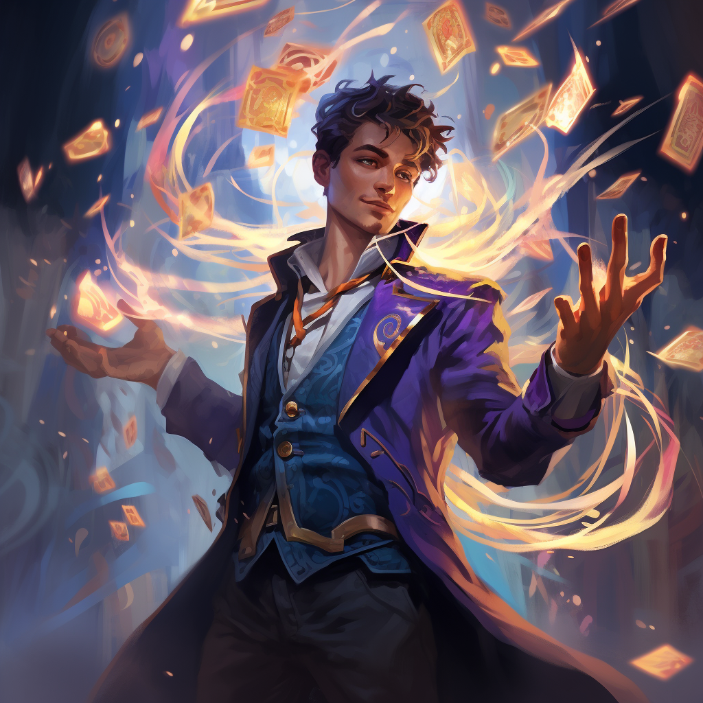

# Iluzje

...

# Zdolności:

S - ilość sukcesów w rzucie kośćmi many

___

**Rozpraszająca iluzja - przeciwnicy ją atakują. Jak trafią - znika.**

___

**Iluzoryczna przeszkoda - przeciwnicy ją omijają dopóki ktoś nie wejdzie. Można ją zmieniać.**

___

**Wyglądacie na większych - zwiększona trudność dla przeciwnika**

___

**Niewidzialność - odporność na S okazyjnych. S rund nie można atakować.**

# [Zdolność epicka](/docs/zdolnosc-epicka.md):

**Prawdziwa iluzja - kopia postaci - jakoś osłabiona - te same zdolności**
