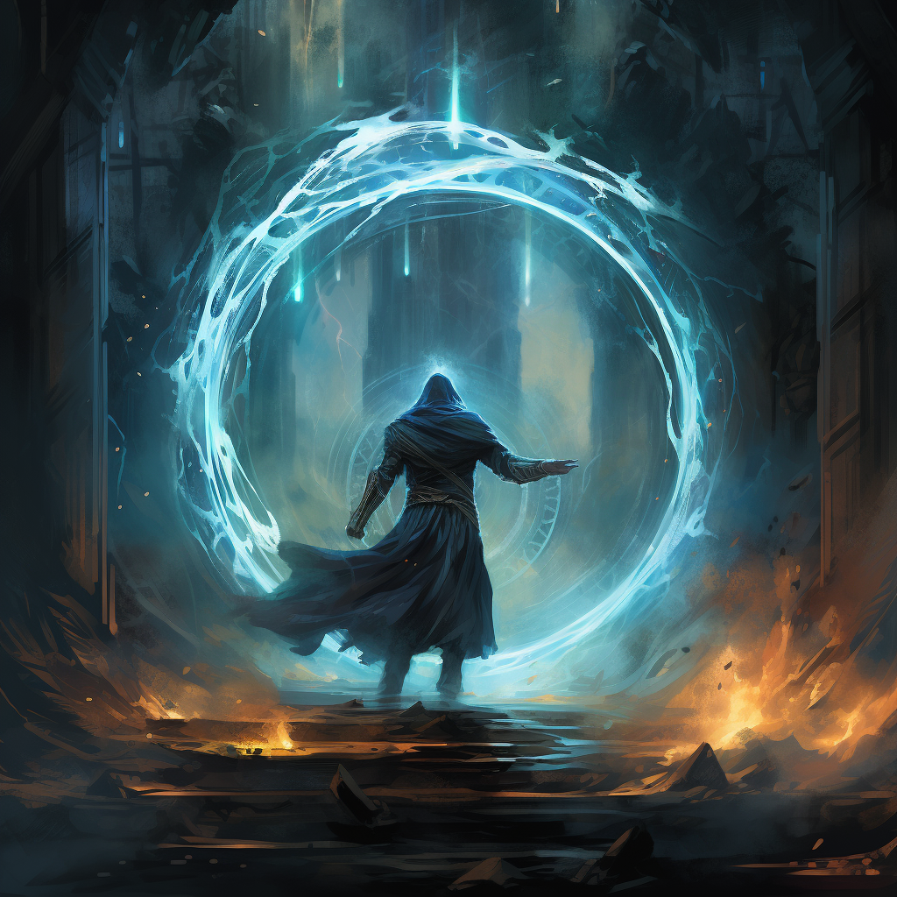

# Telekineza

Telekineza to sztuka manipulacji miejscem w czasoprzestrzeni. Teleportowanie postaci, przyciąganie niewidzialną mocą, zmienianie praw fizyki.

<!--  -->

# Zdolności:

S - ilość sukcesów w rzucie kośćmi many

___

**Teleportacja**

Teleportujesz postać na krótki dystans.

Trudność: 5

Teleportujesz cel o S kroków. Teleportowana postać nie prowokuje okazyjnych ataków.

___

**Manipulacja grawitacją - trudny teren**

Zwiększasz lub zmniejszasz grawitację powodując trudny (krok x2) lub łatwy (krok x 1/2) teren.

Trudność: 5

Manipulujesz grawitacją na S połączonych ze sobą polach

___

**Przysunięcie celu**

Przysuwasz do siebie postać. Przysuwana postać prowokuje okazyjne ataki.

Trudność: 5

Przysuwasz postać o S pól
___

**Zamiania miejsc**

Trudność: Wyższa kość many niechętnych celów. Min. 5.

Musisz uzyskać tyle S ile jest odległości pomiędzy celami./
Jeżeli się uda, cele zamieniają się miejscami poprzez teleportację.

# [Zdolność epicka](/docs/zdolnosc-epicka.md):

**Masowa teleportacja**

Bazowy koszt: 3 many

Teleportujesz S postaci o S kroków.\
Możesz zrezygnować z celu żeby dodać kroki do innego.
